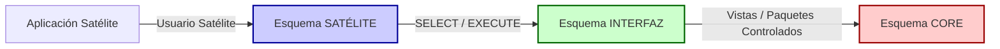

# SP-08 — SUB-POLÍTICA DE SEGMENTACIÓN DE ESQUEMAS Y ACCESO A DATOS  
**Sub-Política Técnica de Nivel 1**  
**Gerencia de Tecnologías de la Información y Comunicaciones (TICs)**

## 1. Principio Rector (texto obligatorio proporcionado)
La presente Sub-Política se basa íntegramente en el siguiente principio normativo:

> **La organización adopta un modelo de seguridad por aislamiento de esquemas, donde el Sistema CORE en Oracle reside en un esquema exclusivo; las Aplicaciones Satélite deben utilizar esquemas propios; y cualquier interacción con el CORE debe realizarse únicamente a través de un esquema de interfaz y mediante usuarios dedicados de conexión, quedando prohibida la creación de objetos satélite en el esquema CORE o el acceso directo desde aplicaciones al mismo.**

Este principio es **vinculante y obligatorio** para todas las áreas técnicas de la Gerencia de TICs.

---

# 2. Objetivo
Definir el modelo de aislamiento obligatorio para la administración de esquemas Oracle, garantizando la integridad del Sistema CORE, la trazabilidad de accesos, la auditoría efectiva, la minimización de riesgos operacionales y la protección de datos.

---

# 3. Alcance
Esta Sub-Política aplica a:
- Bases de datos Oracle administradas por TICs.  
- Sistemas CORE institucionales.  
- Aplicaciones Satélite internas o externas.  
- Integraciones internas y externas hacia el CORE.  
- Procesos de desarrollo, QA, arquitectura, seguridad y operación.

Es obligatoria para todos los entornos: DEV, QA, UAT, PRE-PROD y PROD.

---

# 4. Definiciones Normativas

### 4.1 Esquema CORE
Esquema exclusivo donde residen todos los objetos del Sistema CORE, incluyendo:
- Tablas  
- Vistas  
- Paquetes  
- Funciones  
- Triggers  
- Tipos de datos  

No puede contener objetos de ninguna aplicación satélite.

### 4.2 Esquema SATÉLITE
Esquema perteneciente a una aplicación externa o secundaria que requiere consultar o interactuar con el CORE.  
Debe contener **solo sus propios objetos**.

### 4.3 Esquema de INTERFAZ
Esquema intermediario obligatorio que:
- Expone vistas, sinónimos, o paquetes controlados  
- Permite acceso limitado y regulado al CORE  
- Aplica filtros y masking cuando corresponde  
- Es administrado exclusivamente por DBAs

### 4.4 Usuarios dedicados por aplicación
Cada aplicación deberá poseer:
- Un usuario por ambiente  
- Un usuario por esquema satélite  
- Sin permisos compartidos entre aplicaciones  

---

# 5. Principios Normativos Obligatorios

1. **Prohibición absoluta de crear objetos satélite en el esquema CORE.**  
2. **Prohibición de accesos directos desde aplicaciones al CORE.**  
3. **Todo acceso debe pasar exclusivamente por el esquema de INTERFAZ.**  
4. **Cada aplicación satélite debe tener su propio esquema y usuario.**  
5. **Todos los GRANTs deben ser mínimos, trazables y revocables.**  
6. **Producción/DBAs pueden vetar despliegues que violen esta política.**

---

# 6. Requisitos Técnicos Obligatorios

### 6.1 Aislamiento de Objetos
- Tablas del CORE solo pueden residir en el esquema CORE.  
- Consultas autorizadas deben realizarse mediante vistas de interfaz.  
- Manejo de datos sensibles debe incluir enmascaramiento cuando aplique.

### 6.2 Permisos y GRANTs
Los DBAs únicamente pueden otorgar:
- `SELECT` sobre vistas de interfaz  
- `EXECUTE` sobre paquetes del esquema de interfaz  
- Prohibido otorgar `SELECT`, `INSERT`, `UPDATE`, `DELETE` sobre tablas del CORE a aplicaciones satélite  

Regla estricta:
**NINGÚN GRANT DIRECTO** del CORE a usuarios o esquemas satélite.

### 6.3 Seguridad y Auditoría
El modelo debe garantizar:
- Auditoría de accesos al CORE  
- Registro de consultas  
- Trazabilidad por usuario y por ambiente  
- Revisión periódica de GRANTs

### 6.4 Mecanismo de Conexión
Debe utilizarse:
- Usuario dedicado por aplicación  
- Credenciales almacenadas únicamente en gestor de secretos (SP-07)  
- Conexión restringida por IP/host cuando aplique

### 6.5 Control en Ambientes
En todos los ambientes:
- CORE, SATÉLITE e INTERFAZ deben existir y estar segregados  
- Las reglas de GRANT deben replicarse  
- No se permite acceso ampliado “por simplicidad” en DEV o QA

---

# 7. Responsabilidades

### 7.1 Desarrollo
- Diseñar aplicaciones cumpliendo este modelo de aislamiento.  
- Solicitar objetos de interfaz cuando sean necesarios.  
- Reportar intentos de acceso prohibido.

### 7.2 QA
- Validar que las aplicaciones no accedan al CORE directamente.  
- Confirmar uso correcto del esquema de interfaz.  
- Registrar evidencias en CI/CD.

### 7.3 Arquitectura
- Aprobar modelo de datos satélite.  
- Aprobar todos los cambios estructurales en esquema INTERFAZ.

### 7.4 Seguridad Informática
- Evaluar riesgos de acceso.  
- Exigir auditoría de permisos y revisiones periódicas.

### 7.5 DBAs
- Crear y administrar esquemas.  
- Controlar GRANTs y revocaciones.  
- Mantener integridad del CORE.  
- Vetar despliegues que violen esta política.

---

# 8. Controles Normativos
Un proyecto NO puede avanzar a PRE-PROD ni PROD si:
- Accede al CORE directamente  
- No utiliza el esquema de interfaz  
- Solicita permisos indebidos  
- Incluye objetos satélite en el CORE  
- Carece de usuario dedicado por ambiente  

Producción y DBAs tienen **poder de veto técnico obligatorio**.

---

# 9. Diagrama Mermaid — Segregación CORE / INTERFAZ / SATÉLITE
(Con backticks escapados)



---

# ==========================================
# MANUAL TÉCNICO — SEGMENTACIÓN DE ESQUEMAS (Nivel 2)
# ==========================================

# 1. Propósito Operativo
Brindar instrucciones detalladas para implementar la segregación de esquemas, especificar configuraciones mínimas, detallar GRANTs, definir flujos de acceso y establecer buenas prácticas de seguridad.

---

# 2. Estándares Técnicos

### 2.1 Estructura obligatoria
- `CORE_<sistema>` → Esquema principal  
- `INT_<sistema>` → Esquema de interfaz  
- `SAT_<app>` → Esquemas de aplicaciones satélite  

### 2.2 Objetos permitidos por esquema
| Esquema | Objetos Permitidos | Prohibido |
|--------|--------------------|-----------|
| CORE | Tablas, paquetes propios, funciones, triggers | Objetos satélite |
| INTERFAZ | Vistas, sinónimos controlados, wrappers, paquetes expuestos | Tablas directas |
| SATÉLITE | Tablas propias, procedimientos propios | Cualquier objeto del CORE |

---

# 3. Configuraciones Mínimas

### 3.1 Ejemplo de GRANT permitido (a esquema satélite)
```
GRANT SELECT ON INT_CORE.VW_CLIENTES TO SAT_APP1;
GRANT EXECUTE ON INT_CORE.PKG_OPERACIONES TO SAT_APP1;
```

### 3.2 Ejemplos de GRANT prohibidos
```
GRANT SELECT ON CORE.TB_CLIENTES TO SAT_APP1;  -- PROHIBIDO
GRANT INSERT ON CORE.TB_OPERACIONES TO SAT_APP1; -- PROHIBIDO
```

### 3.3 Enmascaramiento opcional
Cuando corresponda (datos sensibles):
- Usar vistas con columns masking  
- Exponer solo columnas necesarias  
- Aplicar lógica de anonimización

---

# 4. Lineamientos Detallados

### 4.1 Solicitud de nuevos objetos de interfaz
- El desarrollador presenta requerimiento.  
- Arquitectura valida.  
- DBA crea objeto en INTERFAZ.  
- Seguridad revisa si hay exposición indebida.

### 4.2 Ciclo de vida de permisos
- Alta → otorgado por DBAs  
- Revisión periódica → Seguridad + DBAs  
- Baja → revocado al finalizar proyecto o app retirada

### 4.3 Validaciones en CI/CD
Cada pipeline debe validar:
- No existen accesos a CORE  
- Conexiones usan usuario satélite  
- Las cadenas de conexión no apuntan a CORE

---

# 5. Buenas Prácticas
- Aplicaciones deben depender de vistas, nunca de tablas.  
- Evitar exponer demasiada lógica en INTERFAZ.  
- Minimizar GRANTs y revisar su necesidad periódicamente.  
- Documentar todos los objetos de interfaz.

---

# 6. Advertencias y Restricciones
- No existen excepciones “de emergencia”.  
- No se permite acceso temporal directo al CORE ni en QA ni en DEV.  
- Violaciones deben reportarse como INCIDENTE DE SEGURIDAD.

---

# ==========================================
# CHECKLIST — SEGMENTACIÓN DE ESQUEMAS (Nivel 3)
# ==========================================

## 1. Checklist Técnico Normativo
Cada ítem debe ser **SI** para avanzar a QA/UAT/PRE-PROD/PROD.

### 1. Estructura de Esquemas
- [ ] Existencia de esquema CORE  
- [ ] Existencia de esquema INTERFAZ  
- [ ] Esquema SATÉLITE creado para la aplicación  
- [ ] Usuarios dedicados creados por ambiente  

### 2. Permisos
- [ ] No existen GRANTs directos del CORE al SATÉLITE  
- [ ] Todos los GRANTs provienen de INTERFAZ  
- [ ] Se otorgan permisos mínimos  
- [ ] Se revisó auditoría de permisos

### 3. Accesos y Conexiones
- [ ] Aplicación no se conecta al CORE  
- [ ] Cadena de conexión utiliza usuario satélite  
- [ ] Credenciales gestionadas por gestor de secretos (SP-07)

### 4. Pruebas
- [ ] Pruebas de QA verifican ausencia de accesos indebidos  
- [ ] Pipelines validan conexiones correctas  
- [ ] Evidencias almacenadas en CI/CD  

### 5. Auditoría
- [ ] Roles y permisos revisados por DBAs  
- [ ] Seguridad validó abusos de acceso  
- [ ] Arquitectura aprobó objetos de interfaz  

---

# FIN DEL PAQUETE COMPLETO — SP-08
